# MetalTessellationSample
Accompanying materials to [the tutorial on Medium](https://medium.com/@e92rodbearings/advanced-tessellation-with-metal-dynamic-b-spline-surface-79451d19b236).

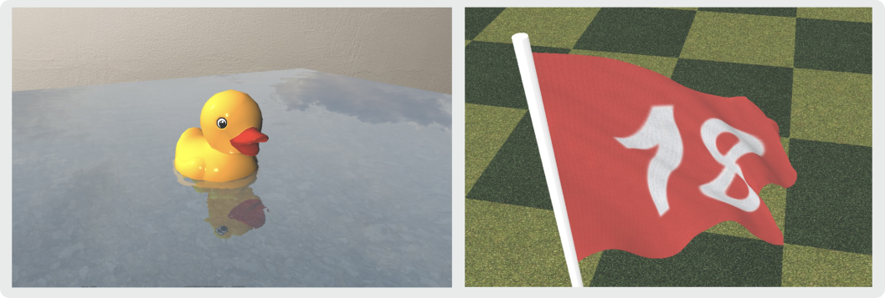

# B-Spline

## Basic B-Spline Basis Functions

<a href="doc/basis_order_0.png"> 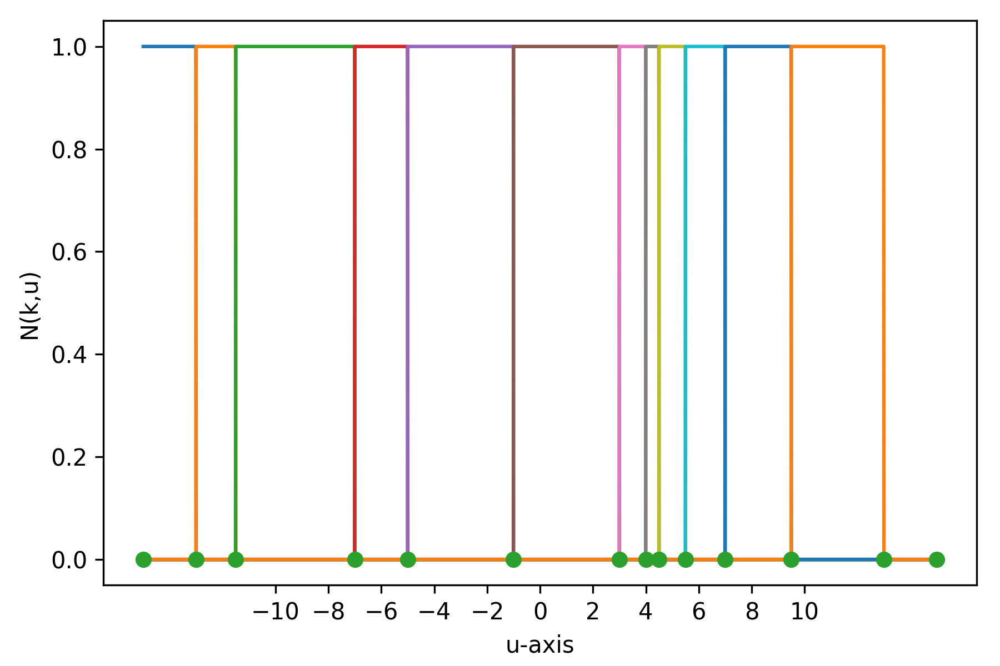</a>
<a href="doc/basis_order_1.png"> 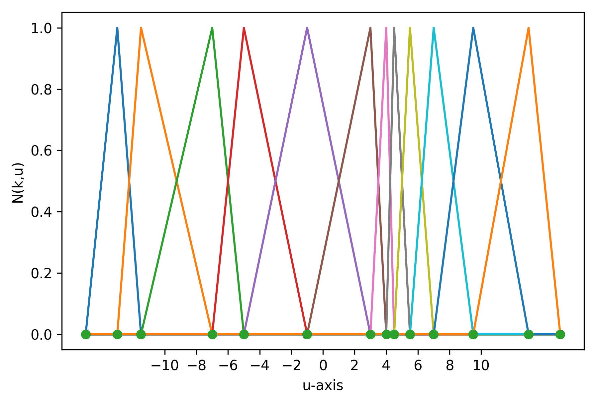</a>
<a href="doc/basis_order_2.png"> 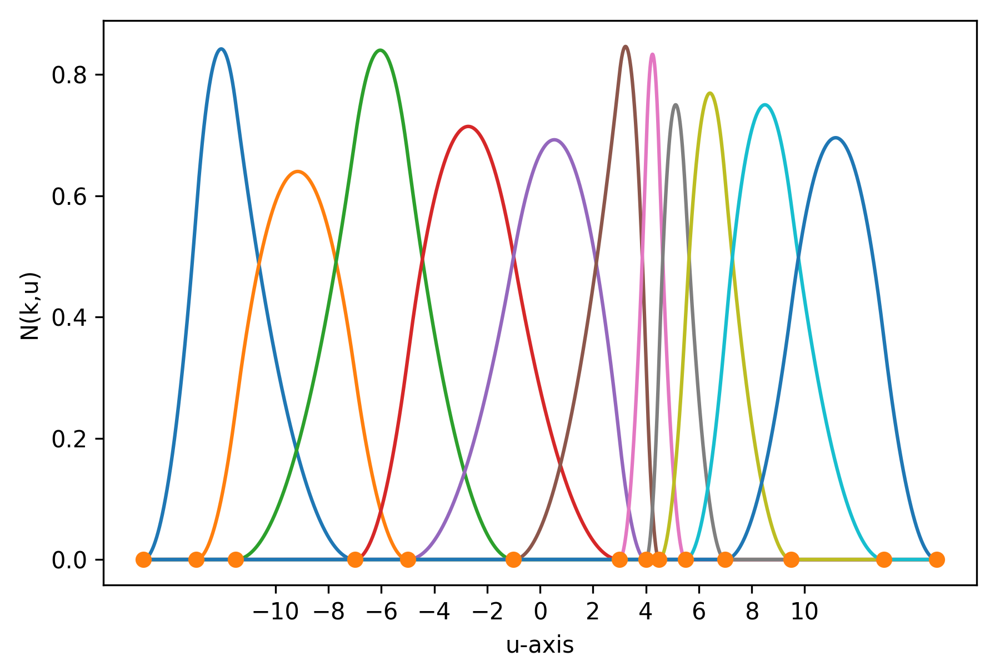</a>

## Basic B-Spline Unit Basis Functions and Interpolations

<a href="doc/basis_order_0_unit.png"> 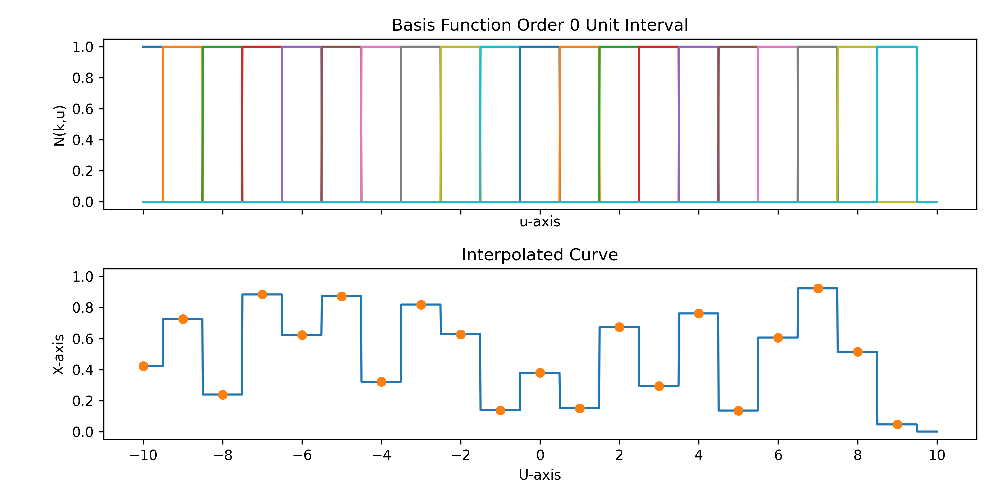</a>
<a href="doc/basis_order_1_unit.png"> 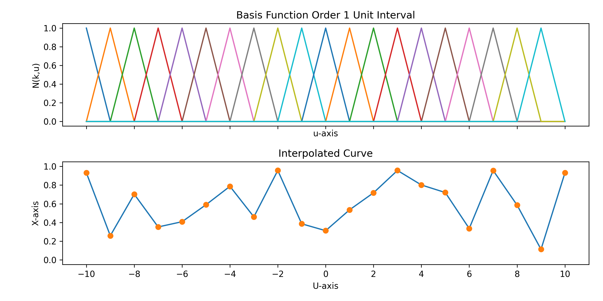</a>
<a href="doc/basis_order_2_unit.png"> 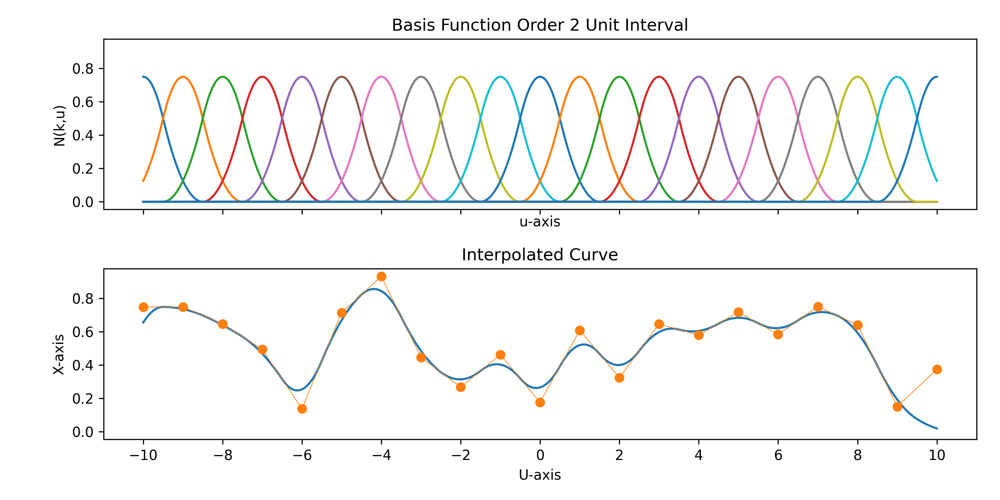</a>

## B-Spline Surface Interpolation

<a href="doc/figure_1.png"> 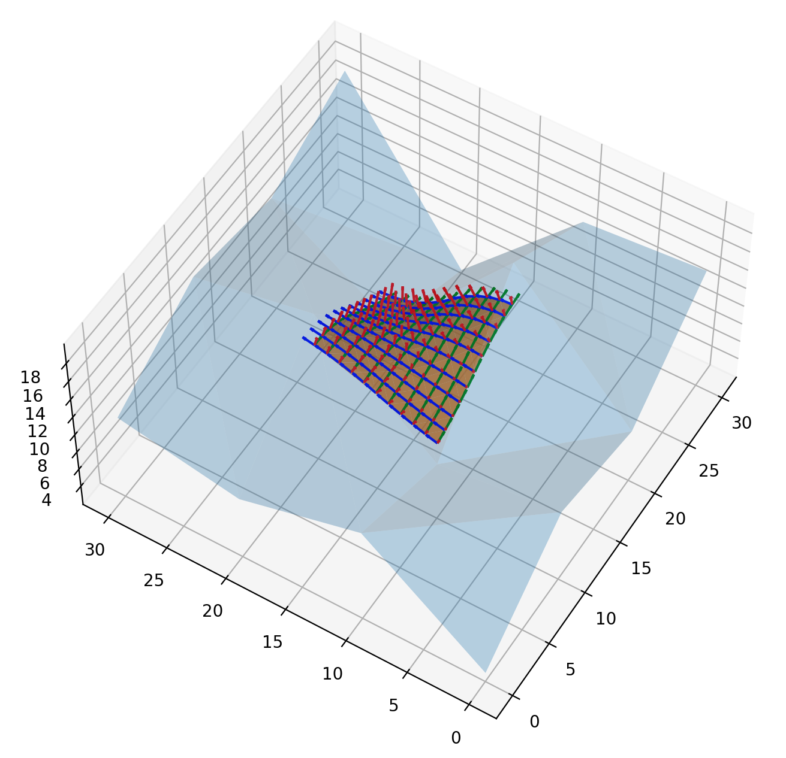</a>
<a href="doc/figure_2.png"> 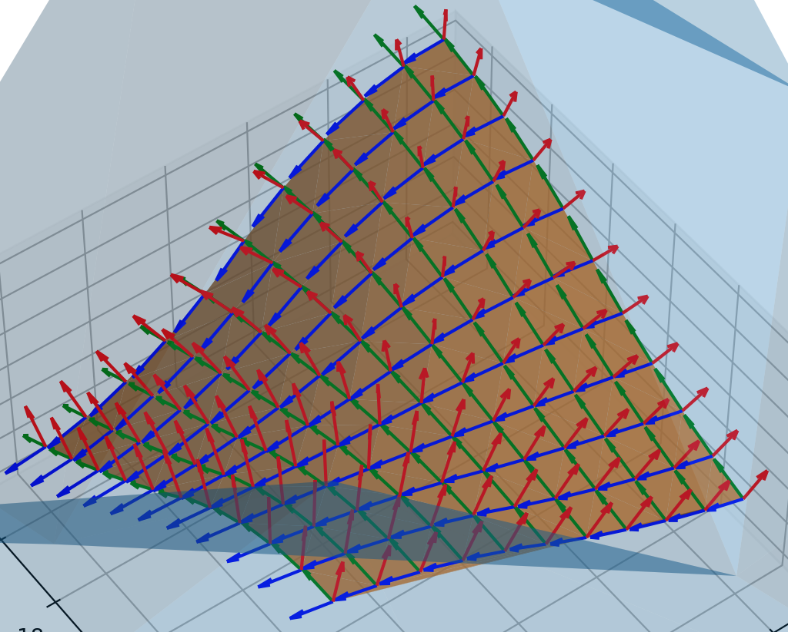</a>

## Metal Tessellation Overview

<a href="doc/render_overview.png"> 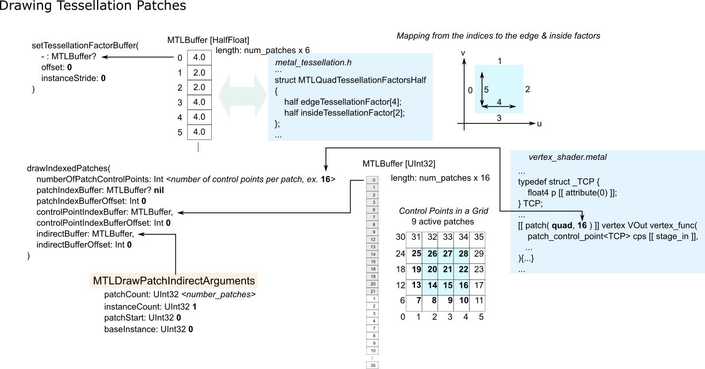</a>
<a href="doc/control_points.png">  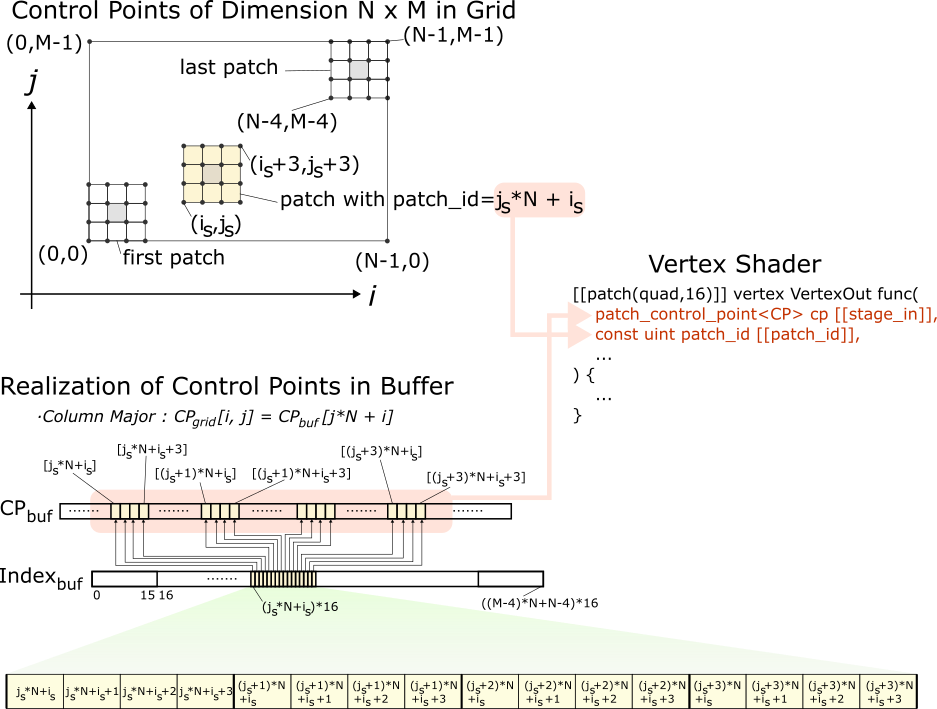</a>

# Demo App
<a href="doc/app.png"> 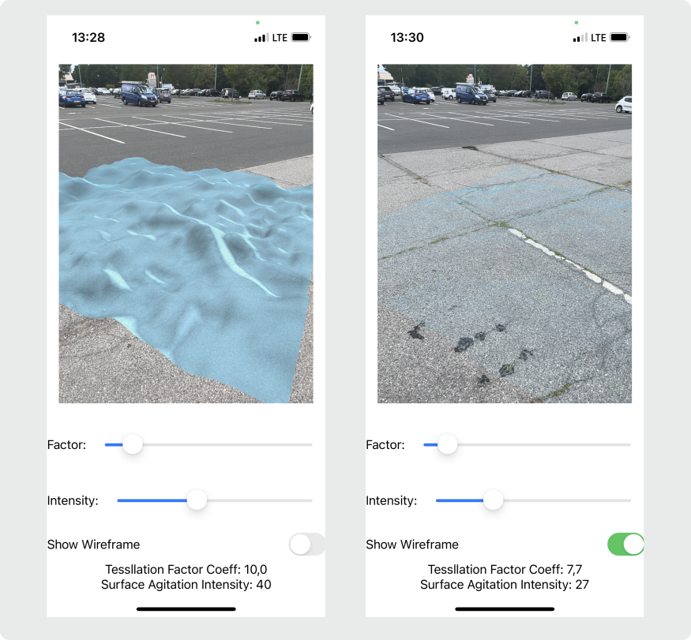</a>

## Demo App Overview

<a href="doc/overview.png"> 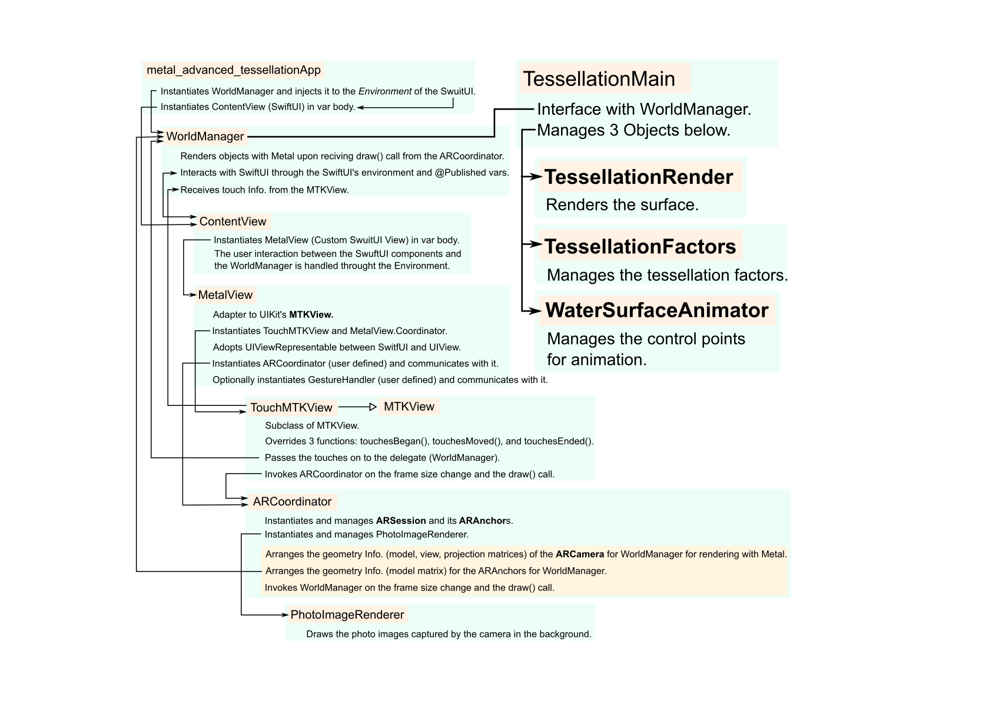</a>